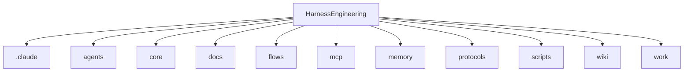

# Code Structure Map

- Generated: 2026-06-10T04:45:59.8509631Z
- Source: scripts/generate-code-map.ps1

## Top-level Files

- .gitignore
- .mcp.json
- AGENTS.md
- CLAUDE.md
- harness.yaml
- README.md

## Top-level Directories

- .claude (33 files)
- agents (5 files)
- core (7 files)
- docs (2 files)
- flows (6 files)
- mcp (4 files)
- memory (7 files)
- protocols (9 files)
- scripts (21 files)
- wiki (7 files)
- work (11 files)

## Mermaid

